# Análisis del Dataset light_spotify_dataset.csv

## Script 1: Carga y exploración inicial

### Carga del dataset

#### Se muestran dimensiones para conocer la cantidad de filas y columnas que contiene el dataset.
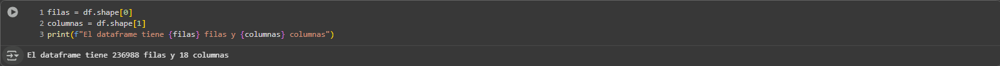{width="6.267716535433071in"height="0.4166666666666667in"}

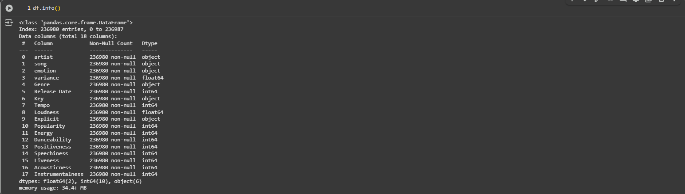{width="6.267716535433071in"height="1.7777777777777777in"}

Primeras 10 filas como muestra para familiarizarse con los datos.

El dataset contiene canciones de Spotify con atributos como artista, canción, emociones, género, tempo, energía, etc.

Es la base para un sistema de recomendación.

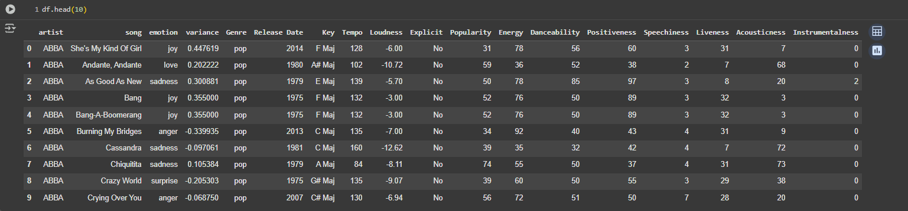{width="6.267716535433071in"height="1.4583333333333333in"}

## Script 2: Limpieza de datos

Se identifican 8 valores que contienen null en la celda "Song" para un total de 236988 lineas de datos, representado el 0,0033%. Por lo que se decide eliminar datos incompletos que puedan afectar el análisis y asegurar que todas las filas tengan al menos el nombre de la canción.

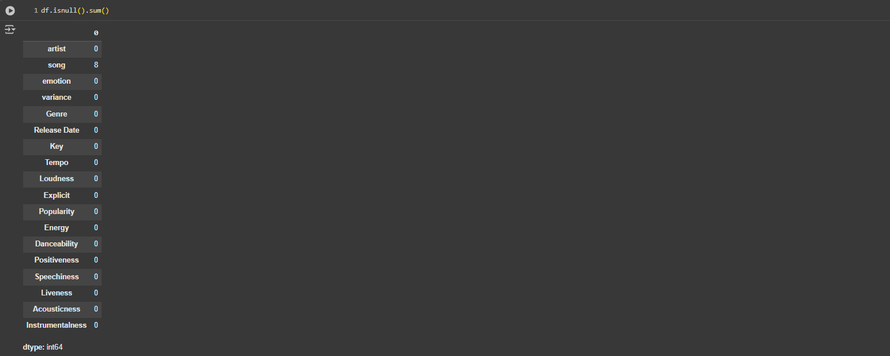{width="6.267716535433071in"height="2.513888888888889in"}

Se eliminan las 8 filas con valores nulos en la columna song.

### Se verifican valores nulos.
```
df.isnull().sum()
```

### Eliminar filas sin nombre de canción
```
df = df.dropna(subset=\[\'song\'\])
```

Se verifica nuevamente para identificar y eliminar datos incompletos que puedan afectar el análisis.

## Script 3: Matriz de correlación.

### Se seleccionan características numéricas relevantes.
```
features =["Danceability","Energy","variance","Tempo","Loudness","Acousticness","Instrumentalness","Speechiness","Positiveness","Popularity","Liveness"]
```
### Calcular matriz de correlación
```
corr_matrix = df\[features\].corr()
```
### Visualizar
```
plt.figure(figsize=(10,8))
sns.heatmap(corr_matrix, cmap=\"coolwarm\", annot=True)
```

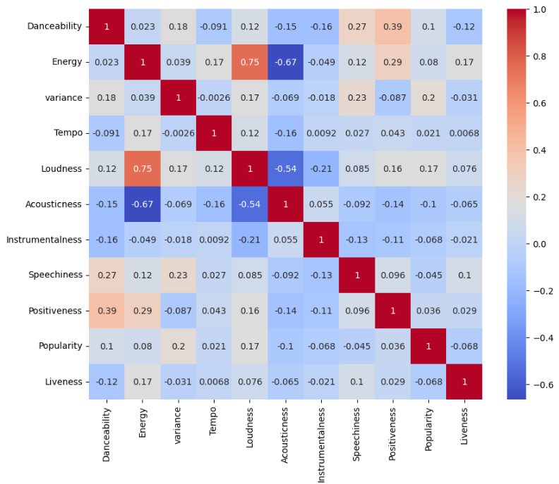{width="6.267716535433071in"height="5.430555555555555in"}

Explorar relaciones entre variables numéricas.

Identificar correlaciones fuertes (positivas o negativas) que puedan
influir en el modelo.

#### Resultado:

Se observa, por ejemplo, que Energy y Loudness están positivamente
correlacionadas (más energía = más volumen).

Acousticness y Energy tienen correlación negativa (música acústica suele
ser menos energética).

## Script 4: Gráficos de dispersión (scatter plots)
```
fig, axes = plt.subplots(4, 2, figsize=(12, 15))
```
#### Varios scatter plots para relaciones clave
```
axes[0,0].scatter(df['Energy'], df['Loudness'], alpha=0.5)
axes[0,0].set_title('Energy vs Loudness')
```
#### ... (otros scatter plots)
```
plt.tight_layout()
```
#### Visualizar relaciones entre pares de variables de forma más detallada.

Comprobar tendencias lineales o agrupamientos.

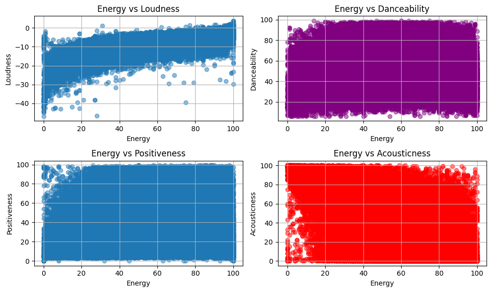{width="6.267716535433071in"height="3.736111111111111in"}

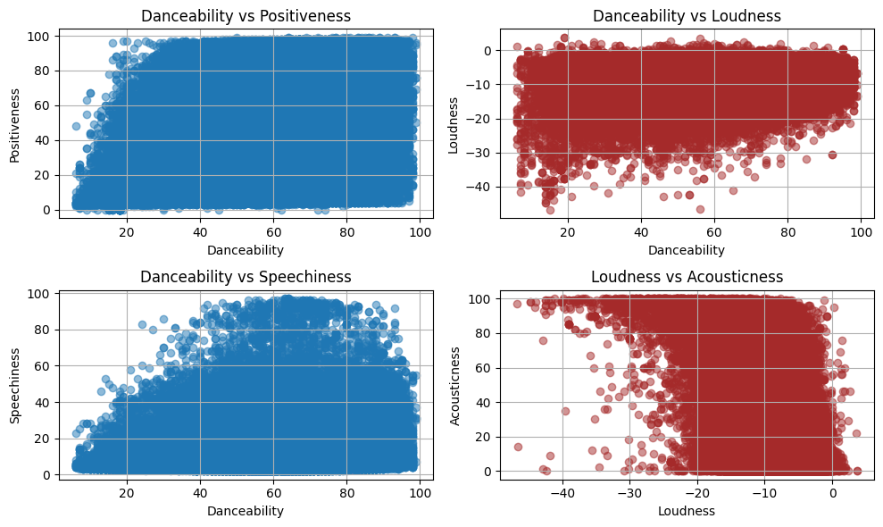{width="6.267716535433071in"height="3.736111111111111in"}

#### Resultado:

Confirmamos visualmente que:

- Las canciones con alta Energy tienden a ser más ruidosas.
- La música muy acústica suele tener menor energía.
- No hay una relación clara entre Danceability y Speechiness.\

## Script 5: Popularidad por artista

#### Identificar los artistas con mayor popularidad promedio.
```
artist_popularity = df.groupby('artist')['Popularity'].mean().sort_values(ascending=False)
top_n_artists = artist_popularity.head(20)
plt.figure(figsize=(12, 6))
top_n_artists.plot(kind='bar')
plt.title('Average Popularity by Artist (Top 20)')
plt.xticks(rotation=90)
plt.tight_layout()
```
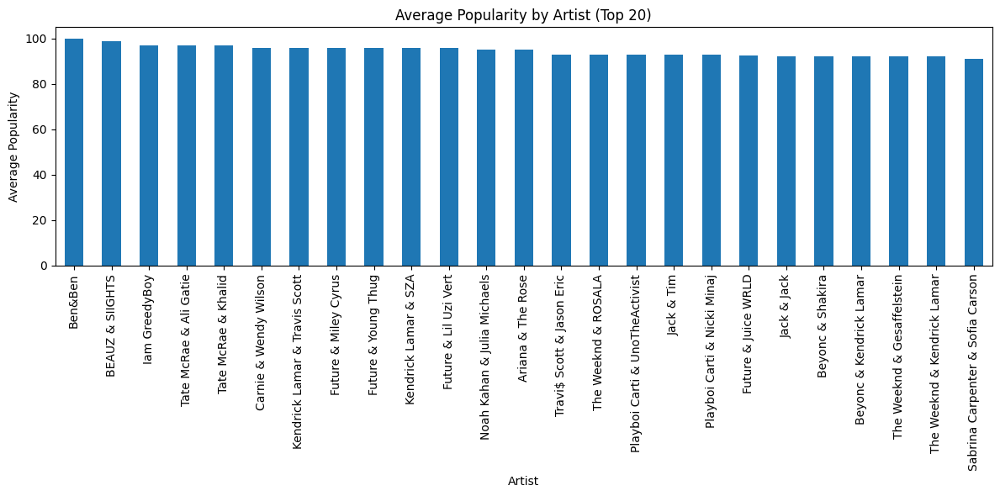{width="6.267716535433071in"height="3.111111111111111in"}\

## Script 6: Canciones más populares y bailables

#### Top 20 canciones más populares

```
top_songs = df.sort_values(by=\'Popularity\', ascending=False).head(20)
plt.bar(top_songs\[\'song\'\], top_songs\[\'Popularity\'\])
plt.title(\'Top 20 Most Popular Songs\')
plt.xticks(rotation=90)
plt.show()
```
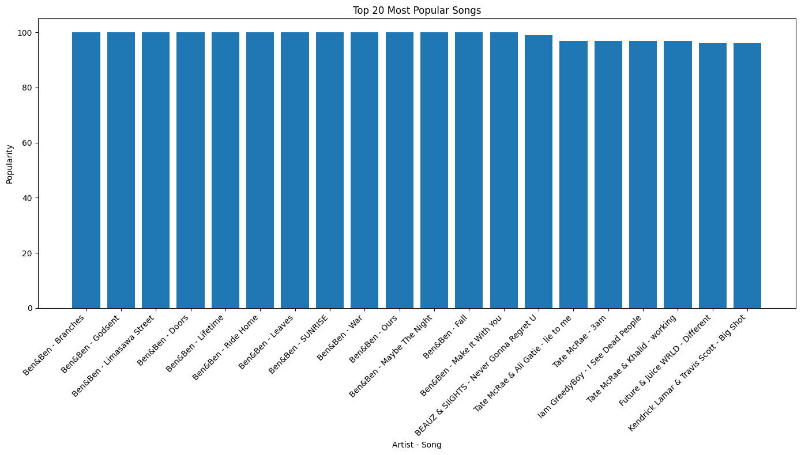{width="6.267716535433071in"height="3.5694444444444446in"}

#### Top 20 canciones más bailables
```
top_dance = df.sort_values(by=\'Danceability\',
ascending=False).head(20)
plt.bar(top_dance\[\'song\'\], top_dance\[\'Danceability\'\])
plt.title(\'Top 20 Most Danceable Songs\')
plt.xticks(rotation=90)
plt.show()
```
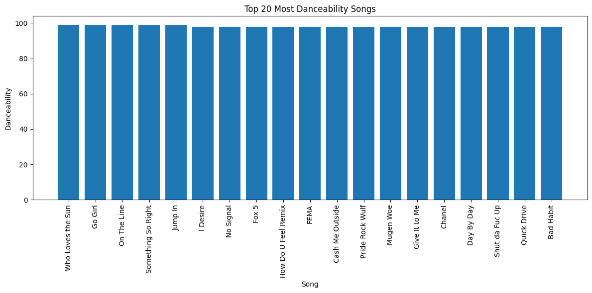{width="6.267716535433071in"height="3.111111111111111in"}

#### Destacar canciones específicas con métricas altas en popularidad y bailabilidad.

Sirve para ejemplificar el tipo de canciones que el dataset contiene.

## Script 7: Modelo de árbol de regresión

```
from sklearn.tree import DecisionTreeRegressor, plot_tree
from sklearn.model_selection import train_test_split
from sklearn.metrics import r2_score, mean_squared_error
```

#### Preparar datos
```
features = ["Popularity", "Danceability", "Positiveness","Speechiness", "Liveness", "Acousticness","Instrumentalness"]
df = df\[features + \[\"Energy\"\]\].dropna()
X = df\[features\]
y = df\[\"Energy\"\]
```
#### Entrenar modelo
```
X_train, X_test, y_train, y_test = train_test_split(X, y, test_size=0.3,random_state=42)
regressor = DecisionTreeRegressor(max_depth=4, random_state=42)
regressor.fit(X_train, y_train)
```
#### Evaluar
```
y_pred = regressor.predict(X_test)
print("R² Score:", r2_score(y_test, y_pred))
print("MSE:", mean_squared_error(y_test, y_pred))
```
#### Visualizar árbol
```
plt.figure(figsize=(20,6))
plot_tree(regressor, filled=True, feature_names=features)
plt.title(\"Árbol de Regresión - Energía\")
plt.show()
```
#### Importancia de características
```
importancias = pd.DataFrame({
'feature': features,
'importance': regressor.feature_importances\_}).sort_values(\'importance\', ascending=False)
```
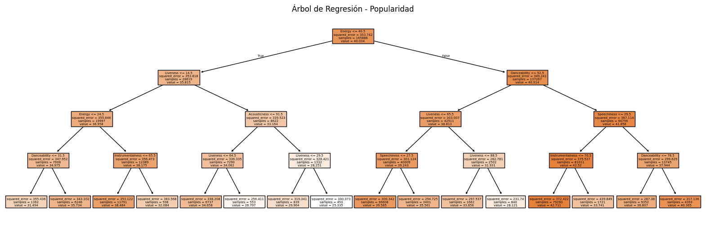{width="6.267716535433071in"height="2.013888888888889in"}

Predecir el nivel de Energy de una canción en función de otras características.
Identificar qué variables son más influyentes.

#### Resultado:

- El modelo tiene un R² de \~0.55, lo que indica una capacidad moderada de predicción.
- Las variables más importantes para predecir Energy son Popularity,Danceability y Loudness.
El árbol de decisión muestra cómo se dividen las decisiones en base a estos atributos.

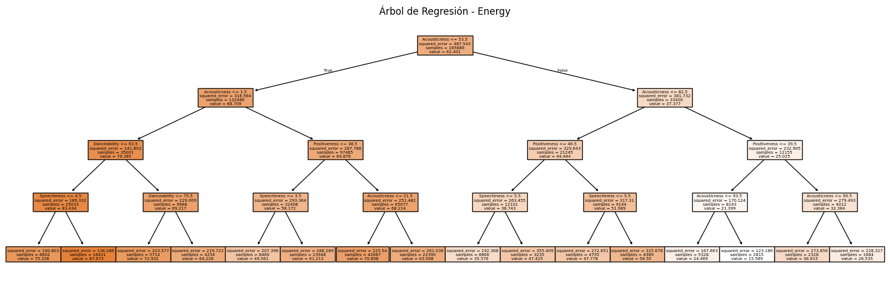{width="6.267716535433071in"height="2.013888888888889in"}

- El dataset es rico en metadatos musicales útiles para sistemas de recomendación.
- Las correlaciones y visualizaciones ayudan a entender el perfil de las canciones.
- El modelo de árbol de regresión muestra que es posible predecir características como la energía en base a otros atributos.
- Este análisis sienta las bases para un motor de recomendaciones basado en similitud o machine learning.